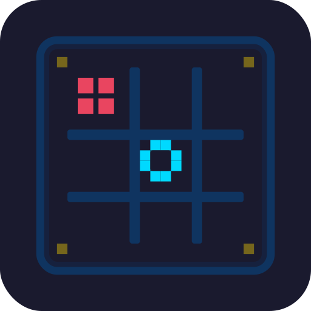

# 🕹️ Retro Tic-Tac-Toe

<p align="center">
  
</p>

A pixel-art styled tic-tac-toe game built with **HTML**, **CSS**, **JavaScript**, and **Node.js WebSockets**.

Play locally with a friend on the same device, or host a room and invite someone across the network with a 6-digit room code.

---

## ✨ Features

| Feature                   | Description                                                          |
| ------------------------- | -------------------------------------------------------------------- |
| 🎮 **Local Game**         | Pass-and-play on the same device                                     |
| 🌐 **Online Multiplayer** | Host or join games via 6-digit room codes                            |
| 💬 **In-Game Chat**       | Talk to your opponent while playing                                  |
| 🎨 **Retro Pixel UI**     | CRT scanlines, neon glows, pixel-perfect typography (Press Start 2P) |
| 🔊 **8-Bit Sounds**       | Synthesized sound effects via Web Audio API — no external assets     |
| 🎉 **Win Animations**     | Pixel-particle bursts, pulsing highlights, board shake on draw       |
| 📱 **Responsive**         | Works on desktop and mobile browsers                                 |

---

## 🚀 Quick Start

### Prerequisites

- [Node.js](https://nodejs.org/) (v18+ recommended)

### Install & Run

```bash
# 1. Install dependencies (ws library)
npm install

# 2. Start the server
npm start

# 3. Open the game in your browser
http://localhost:8080
```

The server serves the static game files **and** runs the WebSocket relay on the same port.

### Play with a Friend on the Same Network

1. **Host** clicks **"Host Game"** → shares the 6-digit room code
2. **Guest** clicks **"Join Game"** → enters the code → clicks **Join**
3. Game starts automatically for both players

---

## 🖥️ How to Play

### Controls

- **Click a cell** to place your mark (X goes first)
- **Restart** — resets the board, keeps scores
- **New Game** — resets board **and** scores
- **Chat** — open the chat panel (network games only)
- **Escape / L** — return to the lobby

### Rules

- First player to get **3 in a row** wins
- Board fills with no winner = **draw**
- Host always plays **X**, guest always plays **O**

---

## 🏗️ Architecture

```
┌─────────────────┐       WebSocket        ┌─────────────────┐
│  Host Browser   │  ◄─────────────────►   │   Node.js       │
│  (X)            │                        │   Relay Server  │
└─────────────────┘                        └─────────────────┘
       ▲                                          ▲
       │                                          │
       │        ┌─────────────────┐               │
       └────────┤  Guest Browser  │───────────────┘
                │  (O)            │
                └─────────────────┘
```

The **server** is a lightweight WebSocket relay. It only forwards messages between the two players — no game state is stored server-side.

### Message Protocol

| Type                   | Direction       | Purpose                          |
| ---------------------- | --------------- | -------------------------------- |
| `host`                 | Client → Server | Create a new room                |
| `join`                 | Client → Server | Join a room by code              |
| `move`                 | Client → Server | Send a board cell index          |
| `restart`              | Client → Server | Request round restart            |
| `newgame`              | Client → Server | Request full reset               |
| `chat`                 | Client → Server | Send chat message                |
| `hosted`               | Server → Client | Room created, host receives code |
| `joined`               | Server → Client | Guest successfully joined        |
| `playerJoined`         | Server → Client | Opponent arrived, start game     |
| `opponentMove`         | Server → Client | Relay opponent's move            |
| `opponentDisconnected` | Server → Client | Opponent left                    |

---

## 📁 Project Structure

```
tic-tak-toe/
├── index.html          # Game UI (intro screen, lobby, board, chat panel)
├── style.css           # Retro pixel-art styles, animations, responsive layout
├── script.js           # Game logic, WebSocket client, UI interactions
├── server.js           # Node.js WebSocket relay + static file server
├── package.json        # Project metadata & npm scripts
├── node_modules/       # Dependencies
└── .kimchi/            # Development docs & plans
```

### File Breakdown

| File         | Responsibility                                                                                            |
| ------------ | --------------------------------------------------------------------------------------------------------- |
| `index.html` | Page structure, Google Font import, DOM layout                                                            |
| `style.css`  | CRT scanline overlay, neon glow effects, floating intro animations, chat panel, responsive grid           |
| `script.js`  | Game state, win/draw detection, WebSocket connection management, lobby flow, chat system, sound synthesis |
| `server.js`  | Express-style HTTP server for static files + `ws` WebSocket server for room management and message relay  |

---

## 🎯 Tech Stack

- **Frontend**: Vanilla HTML5, CSS3, ES6+ JavaScript
- **Backend**: Node.js, [`ws`](https://github.com/websockets/ws) WebSocket library
- **Fonts**: [Press Start 2P](https://fonts.google.com/specimen/Press+Start+2P) (Google Fonts)
- **Audio**: Web Audio API (oscillators, gain nodes — no external sound files)

---

## ⚙️ Environment Variables

| Variable | Default | Description           |
| -------- | ------- | --------------------- |
| `PORT`   | `8080`  | Server listening port |

```bash
PORT=3000 npm start
```

---

## 🚧 Known Limitations

- **No persistence**: Rooms and scores vanish when the server restarts
- **2 players max per room**: No spectating or more than 2 players
- **Same origin WebSocket**: The WebSocket URL is auto-detected from the browser's current host — works out of the box on localhost or a single domain

---

## 📝 License

ISC
